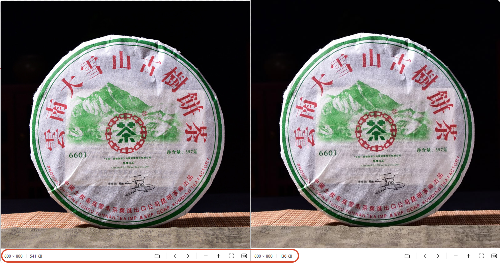

# 微损压缩JPG

一个 Windows 本地 JPG/PNG 批量压缩工具。界面为原生 Windows EXE，核心调用 Jpegli 的 `cjpegli.exe`，输出普通 JPG。

> 适合电商产品图、茶叶产品图、商品详情图等批量压缩场景。

## 压缩效果对比



压缩率75%，肉眼看不出差距

## 功能

- JPG / PNG 输入，统一输出 JPG
- PNG 透明背景自动合成白底
- 自动处理 JPEG EXIF 方向
- 可限制最大宽度，默认 1280
- 支持固定质量压缩，默认 q=85
- 支持目标 KB 模式，在 min q / max q 范围内自动寻找合适质量
- 支持采样选择：420 / 422 / 444
- 支持可选 jpegtran 二次优化
- 调用 `cjpegli.exe` 时隐藏黑窗口

## 推荐参数

| 参数 | 推荐值 |
|---|---:|
| 质量 q | 85 |
| 采样 | 420 体积最小 |
| 最大宽 | 1280 |
| 目标KB | 0 |
| min q | 72 |
| max q | 90 |

`目标KB=0` 表示固定质量压缩；填写目标体积后，会在 min q / max q 范围内自动寻找尽量接近目标体积的最高质量。

## 目录结构

```text
微损压缩JPG.exe
tools/
  cjpegli.exe       必须
  jpegtran.exe      可选，没有会自动跳过
```

`cjpegli.exe` 和 `jpegtran.exe` 不随源码仓库分发，请自行下载后放到 `tools/` 目录。

## 构建

需要 Go 1.22+。

```bat
build_windows.bat
```

或手动执行：

```bat
set GOOS=windows
set GOARCH=amd64
go build -ldflags "-H=windowsgui -s -w" -o "dist\微损压缩JPG.exe" .
```

## 许可证

本项目源码使用 MIT License。

第三方工具请遵守其各自许可证：

- Jpegli / libjxl / cjpegli：BSD-3-Clause
- libjpeg-turbo / jpegtran：IJG / BSD-style / zlib style licenses
